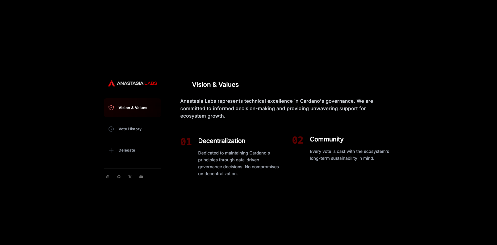
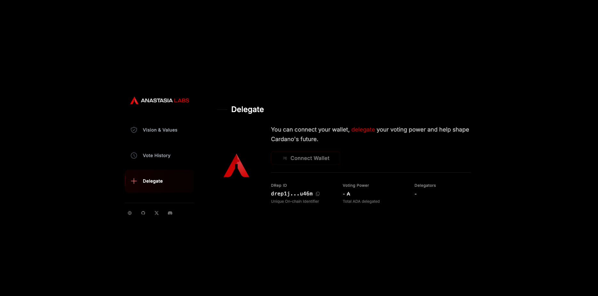
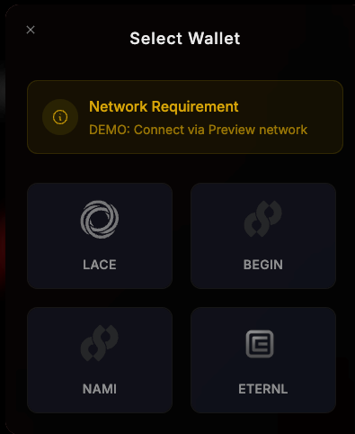
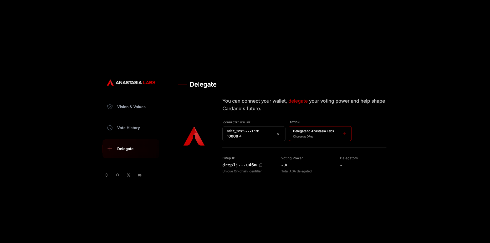
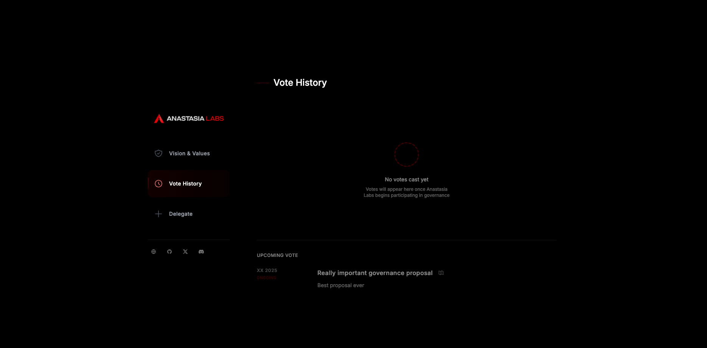

# Cardano DRep Delegation Example with Next.js

This project demonstrates a modern web interface for delegating voting power to a Delegation Representative (DRep) in Cardano governance system. It provides an example of how to integrate Cardano wallets with a Next.js application and handle on-chain governance transactions using Evolution library.

## Technologies Used

- **Next.js**: React framework for the frontend and API routes
- **@lucid-evolution/lucid**: Library for building and submitting Cardano transactions
- **@cardano-foundation/cardano-connect-with-wallet**: For wallet connection and CIP-30 interactions
- **Tailwind CSS**: For styling the UI

## Prerequisites

- Node.js 18+ and pnpm
- A Cardano wallet with extension (like Eternl, Nami, Flint, etc.)
- Some tAda on testnet if you're testing on Preprod

## Setup and Installation

1. Clone the repository:

   ```bash
   git clone https://github.com/lucid-evolution/lucid-evolution.git
   cd lucid-evolution/examples/with-next-js
   ```

2. Install dependencies:

   ```bash
   pnpm install
   ```

3. Set up environment variables:

   ```bash
   cp .env.example .env.local
   ```

4. Edit the `.env.local` file with your configuration:

   ```
   # DRep IDs for governance voting
   DREP_ID_MAINNET=your_mainnet_drep_id
   DREP_ID_PREPROD=your_preprod_drep_id

   > **Important**: The DRep IDs must be properly configured or you'll encounter a "DRep ID not properly configured" error when attempting to delegate.

   ```

5. Start the development server:

   ```bash
   pnpm dev
   ```

6. Open [http://localhost:3000](http://localhost:3000) in your browser

## Building for Production

To create a production build:

```bash
pnpm build
```

## User Interface

### Main Screen



### Initial Connect Wallet Screen



### Wallet Selection Modal



### Connected Wallet View



### Voting History



## Troubleshooting

### "DRep ID not properly configured" Error

If you encounter this error when attempting to delegate:

1. Ensure you have created a `.env.local` file with valid DRep IDs
2. Make sure the DRep IDs are properly formatted and valid
3. Check the browser console for additional error details

### Wallet Connection Issues

1. Ensure you have a supported wallet installed (Eternl, Nami, Flint, etc.)
2. Check that your wallet is set to the correct network (Mainnet or Preprod)
3. Try refreshing the page and reconnecting
