# Example - DRep Delegation

A nice looking web interface for delegating voting power to a DRep. Easy to swap out the DRep ID and other config stuff for your own DRep/usecases and just use it as a starting point.

## User Interface

### Main Screen


### Voting History


### Initial Connect Wallet Screen


### Wallet Selection Modal


### Connected Wallet View


## Setup

```bash
pnpm install

pnpm dev

pnpm build
```

## Environment Variables

This project uses environment variables for configuration. Copy the `.env.example` file to `.env.local` to set up your environment:

```bash
cp .env.example .env.local
```

Then edit the `.env.local` file to add your configurations:

- `DREP_ID_MAINNET`: Your DRep ID for mainnet
- `DREP_ID_PREPROD`: Your DRep ID for preprod testnet
- `KOIOS_API_MAINNET`: Koios API endpoint for mainnet (optional)
- `KOIOS_API_PREPROD`: Koios API endpoint for preprod testnet (optional)

For development, the application will use the preprod variables. In production, it will use the mainnet variables.

## Flow

```mermaid
%%{init: {'theme': 'base', 'themeVariables': { 'fontSize': '16px' }}}%%
flowchart LR
    subgraph Phase3[" Connection "]
    direction TB
        User -->|Yes| D[Connect Wallet<br>CIP-30]
    end

    subgraph Phase4[" Delegation "]
    direction TB
        D --> E[Delegate Button]

        subgraph " Tx Building"
        direction TB
            E --> F1[Frontend Captures<br>Delegation Intent]

            F1 --> F2[Send Request<br>to Backend]

            F2 --> F3[Backend Builds<br>Tx]

            F3 --> F4[Return tx.cbor<br>to Frontend]
        end

        F4 --> G[Wallet Signs<br>tx.cbor]

        G --> H[Transaction<br>Confirmed]
    end

    style User fill:#f0f0f0,stroke:#333
    style H fill:#e6ffe6,stroke:#333
    style F1 fill:#fff4e6,stroke:#333
    style F2 fill:#fff4e6,stroke:#333
    style F3 fill:#fff4e6,stroke:#333
    style F4 fill:#fff4e6,stroke:#333

    classDef secureProcess fill:#fff4e6,stroke:#333;
    classDef default font-size:14px;
    classDef phase font-size:16px,font-weight:bold;
    class Phase1,Phase2,Phase3,Phase4 phase
```


